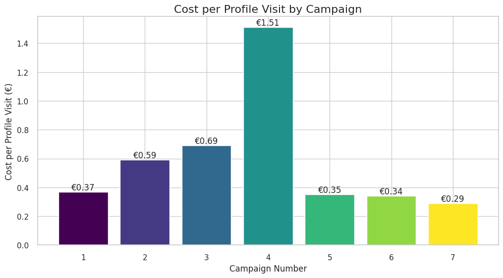

# UniqueAble Instagram Analytics Data Visualization

This project analyzes Instagram advertisement data and visualizes key metrics through various charts and graphs. The data is centered around audience demographics, engagement statistics, and cost efficiency across different posts, locations, and audience types.

## Dataset Description

The dataset used in this project contains the following information for each Instagram campaign:

- **S.no**: Serial number of the campaign.
- **Post Type**: The type of post (e.g., product post, reel).
- **Age Range**: The target age range of the audience.
- **Female/Male**: The percentage of female and male audience reached.
- **Location**: The location targeted by the campaign.
- **Accounts Reached**: The number of accounts reached by the campaign.
- **Profile Visit**: The number of profile visits generated from the campaign.
- **Spent**: The total amount spent on the campaign in Euros (€).
- **Cost per Profile Visit**: The average cost to generate a profile visit for the campaign.

## Visualization Overview

The code generates several visualizations that provide insights into the effectiveness of each Instagram campaign. Below is a description of each chart and the context behind it.

### 1. **Cost per Profile Visit by Campaign**
This bar chart shows the **Cost per Profile Visit** for each campaign, providing an overview of how efficiently the marketing budget was spent across campaigns. Value labels on each bar indicate the exact cost for each campaign.



### 2. **Gender Targeting vs. Efficiency**
A scatter plot visualizing the relationship between the **Female** and **Male** audiences targeted, the **Profile Visits** generated, and the **Cost per Profile Visit**. Larger bubbles represent campaigns that generated more profile visits.


### 3. **Geographic Efficiency Comparison**
This two-part bar plot compares the **Cost per Profile Visit** and **Profile Visits** for different **Locations**. This visualization helps to assess which locations were more cost-effective and drove higher engagement.


### 4. **Efficiency vs. Reach by Location**
This scatter plot shows the relationship between **Accounts Reached** and **Cost per Profile Visit** for each campaign, with bubbles sized according to **Profile Visits** and colored by the amount **Spent**. It helps identify campaigns that reached more accounts with a lower cost per visit.


### 5. **Post Type Efficiency**
This plot highlights how different **Post Types** (e.g., one product, multiple products, reel) perform in terms of **Cost per Profile Visit**. Each point on the scatter plot represents a campaign, with bubble sizes indicating **Profile Visits**.


### 6. **Ad Spend vs. Cost Efficiency**
A scatter plot that shows the relationship between **Spent** (the amount spent on ads) and **Cost per Profile Visit**. The hue distinguishes different post types, providing insight into the relationship between ad spend and efficiency.


### 7. **Relationship between Profile Visits and Cost per Visit**
This regression plot explores the correlation between **Profile Visits** and **Cost per Profile Visit**, revealing how increased engagement can impact cost efficiency.


## Requirements

To run the analysis and generate the visualizations, the following Python libraries are required:

- **pandas**
- **matplotlib**
- **seaborn**
- **numpy**

You can install the necessary dependencies using:

```bash
pip install pandas matplotlib seaborn numpy
